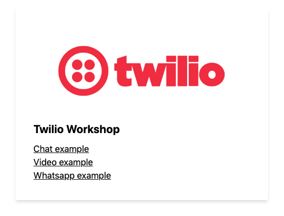

# Twilio Workshop



Today we're gonna cover [Video](), [Chat]() and messaging using Whatsapp, [Twilio Studio]() and [Autopilot]().

## Workshop files

[![Edit [WORKSHOP] Kick off!](https://codesandbox.io/static/img/play-codesandbox.svg)](https://codesandbox.io/s/workshop-kick-off-unnum?fontsize=14)

For the whole day we'll work on a slimed down version and reimplement the functionality for chat, video and whatsapp.

## How will we work

Have a look [at the issues](https://github.com/stefanjudis/twilio-workshop-final/issues) and solve them one by one. :) Choose your path and build what you like. ✌️

## Local development

Clone the repository and run `npm install`. Copy the `.env` sample file and fill it with the needed credentials.
You can find instruction in [this GitHub isse](https://github.com/stefanjudis/twilio-workshop-final/issues/1).

```
$ git clone git@github.com:stefanjudis/twilio-workshop-final.git
$ npm install
$ cp .env.sample .env
$ npm start
```

To start the local environment run `npm start`. `localhost:8888` will be available. 🎉

## Final implementation (to sneak peak and find solutions)

[](https://codesandbox.io/s/twilio-workshop-qli5j?fontsize=14)

This repository included the final implementation and you can have a look at how things are implmented. Try following the instructions in the issues though. 🙈